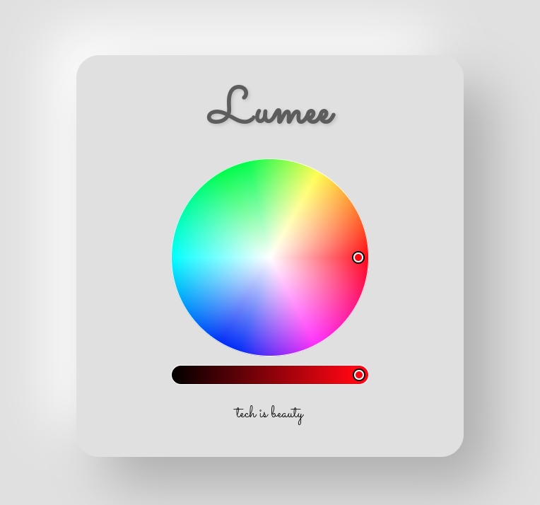
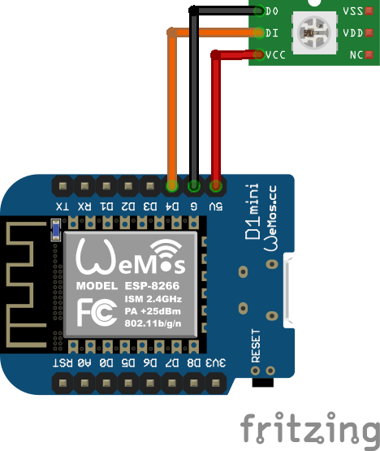

## ⭐ Lumee

  
<strong>LUMEE IS TECH AND TECH IS BEAUTY</strong> 

Este é um acessório divertido e inovador que adiciona um toque de cor e brilho à sua aparência. Com uma variedade de cores e efeitos de iluminação, você pode personalizar o seu visual com cores que se enciaxam com seu estilo e humor.

O projeto permite que você acesse uma página web, através do seu computador ou celular, e através dela escolha uma cor para LEDs RGB endereçáveis.

O projeto foi desenvolvido com a placa Wemos (ESP8266) como microcontrolador e conta também com uma bateria que pode ser recarregada através de um cabo USB permitindo uma maior flexibilidade de uso.

O código foi desenvolvido com C/C++ usando a extensão [PlatformIO](https://platformio.org/) do Visual Studio Code.

## 🤖 Como usar este projeto

Para utilizar este projeto, você precisa fazer o upload do arquivo [main.cpp](./src/main.cpp) para a placa microcontrolada e montar o circuito como mostrado no esquemático abaixo:

Depois disso, basta acessar o link `http://lumee.local` de qualquer dispositivo para controlar as cores dos LEDs usados.

## 📚 Bibliotecas usadas

-   [WiFiManager](https://github.com/tzapu/WiFiManager)
-   [Adafruit_NeoPixel](https://github.com/adafruit/Adafruit_NeoPixel)

## 🤝 Parcerias

Este projeto foi desenvolvido em parceria com:

